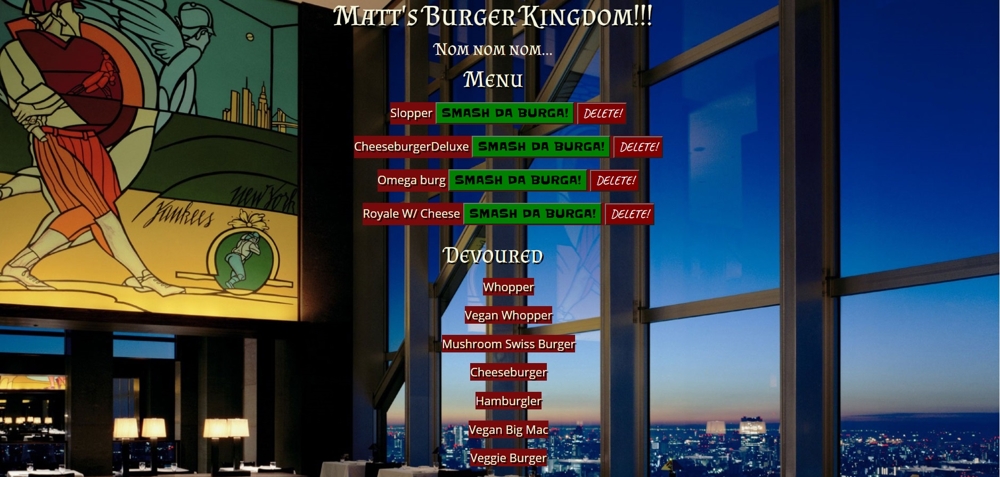
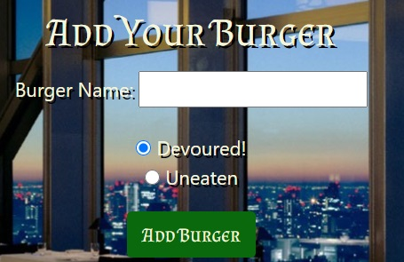

* Matt's Burger Kingdom

<!-- Live link to deployed app -->
Repository: https://github.com/Mdudzik92/mattsburgerkingdom/
Deployed app: https://mdudzik92.github.io/mattsburgerkingdom/

<!-- Technologies used -->
JavaScript, MySQL, Node, Express, Handlebars and a homemade ORM

<!-- Explanation of what the app is -->
This is an app which allows the user to add a burger to their order. When the burger has been "Devoured", the user can then click the button labeled "SMASH DA BURGA!" which moves their burger to the Devoured column. The user can also add their own burger by typing in the kind of burger they want and add whether or not it has been devoured or should be added to the menu.  

<!-- Screenshot -->

<!-- License -->
MIT

<!-- Contact information -->
Email: mdudzik92@gmail.com